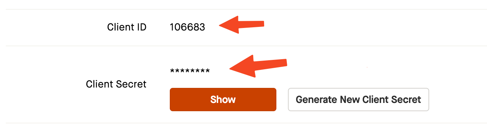
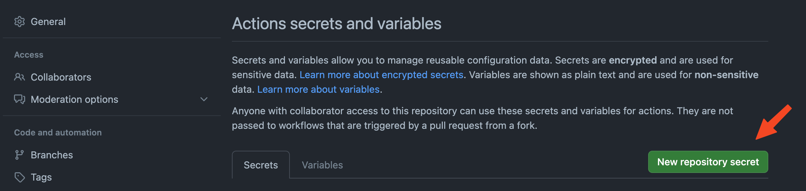
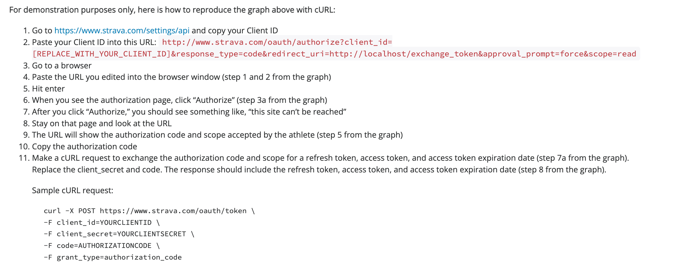
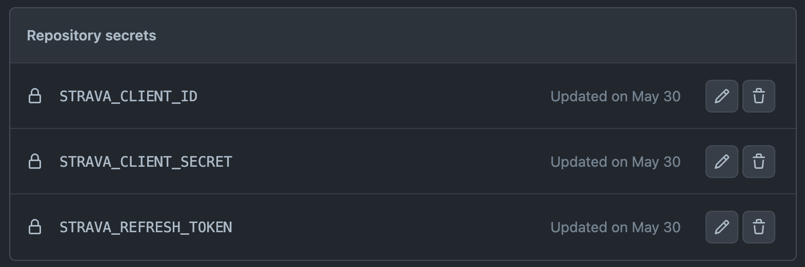
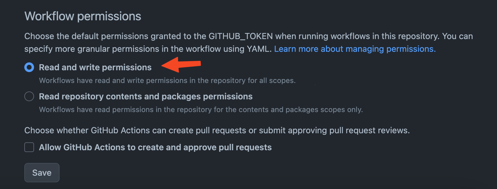
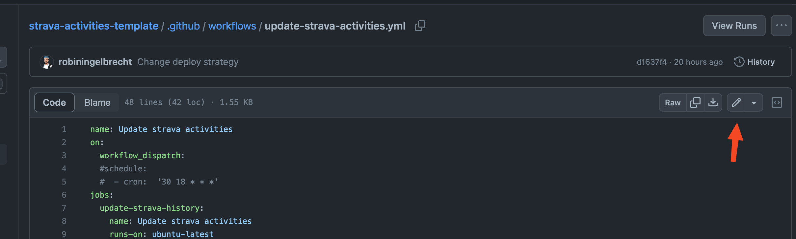
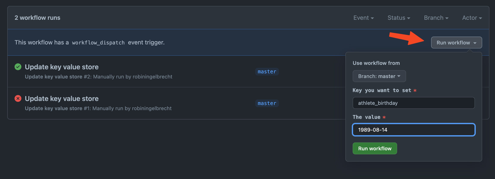
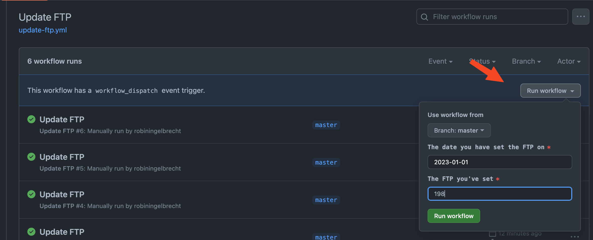

<p align="center">
    
</p>

<p align="center">
<a href="https://github.com/robiningelbrecht/strava-activities-template/actions/workflows/ci.yml"></a>
<a href="https://codecov.io/gh/robiningelbrecht/strava-activities-template" ></a>
<a href="https://github.com/robiningelbrecht/strava-activities-template/blob/master/LICENSE"></a>
<a href="https://phpstan.org/"></a>
<a href="https://php.net/"></a>
</p>

---

# Strava activities template

This repository contains the template code to generate your own Strava statistics pages.
Just follow the steps below. If you experience any issues with any of the steps,
feel free to [open an issue](https://github.com/robiningelbrecht/strava-activities-template/issues/new). I'll be glad to help you out 💅.

## 🦄 Examples

* Markdown version: https://github.com/robiningelbrecht/strava-activities
* HTML version: https://strava-statistics.robiningelbrecht.be/

## 🪄 What you'll need

* A Strava API key
* A GitHub account

## 🛠️ Installation

* Make sure your logged in with your GitHub account
* Start off by showing some ❤️ and give this repo a star
* [Create a new repository](https://github.com/new?template_name=strava-activities-template&template_owner=robiningelbrecht) using this template
* Navigate to your newly created repository `Actions secrets and variables` page (https://github.com/[YOUR-GITHUB-USERNAME]/[REPOSITORY-NAME]/settings/secrets/actions)
  Keep this page open, you will need to add several secrets here
* Next, navigate to your [Strava API settings page](https://www.strava.com/settings/api).
  Copy the `client ID` and `client secret`
  
* Create two new repository secrets
  
    * __name__: STRAVA_CLIENT_ID, __value__: `client ID` copied from Strava API settings page
    * __name__: STRAVA_CLIENT_SECRET, __value__: `client secret` copied from Strava API settings page
* Now you need to obtain a `Strava API refresh token`. This might be the hardest step.
    * Navigate to https://developers.strava.com/docs/getting-started/#d-how-to-authenticate
      and scroll down to "_For demonstration purposes only, here is how to reproduce the graph above with cURL:_"
    * Follow the 11 steps explained there
    * Make sure you set the `scope` in step 2 to `activity:read_all` to make sure your refresh token has access to all activities
      
    * Create a repository secret with the refresh token you obtained: __name__: STRAVA_REFRESH_TOKEN, __value__: The `refresh token` you just obtained
* You should end up with these repository secrets:
  
* After this you need to make sure the automated workflow is able to push changes to your repo.
    * Navigate to https://github.com/[YOUR-GITHUB-USERNAME]/[REPOSITORY-NAME]/settings/actions
    * Scroll down to `Workflow permissions` and make sure `Read and write permissions` is checked
      
* The last thing you need to do is edit the workflow files `update-strava-activities.yml`, `update-ftp.yml` and `update-key-value-store.yml`:
    * Navigate to https://github.com/[YOUR-GITHUB-USERNAME]/[REPOSITORY-NAME]/edit/master/.github/workflows
    * Edit the file
      
    * Uncomment line 4 and 5 by removing the `#` character
    * Scroll own to:
        ```yml
        name: Initialize GIT
        run: |
          git config --global user.name 'YOUR_GITHUB_USERNAME'
          git config --global user.email 'YOUR_GITHUB_USERNAME@users.noreply.github.com'
        ```

        * Replace `YOUR_GITHUB_USERNAME` with your own username
        * Click `commit changes` at the top right-hand corner
    * Do this again for the other 2 files

## Configuration

Before running the first activity import, you need to 

* Set your birthday. This is required to 1) accurately calculate the intensity of your activities 
  in case no power data is available, 2) determine your heart rate zones
  * Navigate to https://github.com/[YOUR-GITHUB-USERNAME]/[REPOSITORY-NAME]/actions/workflows/update-key-value-store.yml
  * Fill out your birthday and run the workflow
  * 
* Configure your FTP (= Functional Threshold Power) history.
  * Navigate to https://github.com/[YOUR-GITHUB-USERNAME]/[REPOSITORY-NAME]/actions/workflows/update-ftp.yml
  * Fill out the FTP and the date you've set the FTP on and run the workflow
  * 
  * Do this for every FTP you've set
* !!! It's important you wait until a workflow is done, before running another one !!!

## ☁️ Hosting the HTML version

There's also a HTML versions available with a lot more features. You can easily host this for free
on https://vercel.com:

* Create an account and login
* Make sure your connect to your GirHub account (https://vercel.com/account/login-connections)
* Create a new project and reference your repository
* For the `Framework preset` setting use `Other`
* Make sure the `Root directory` is set to `build/html`
* You can uncheck the option `Include source files outside of the Root Directory in the Build Step.`
* You should be good to go

## 🧐 Some things to consider

* Any new feature or update added to the template, will automatically end up in your repository 🪄
* Only (virtual) bike rides are imported, other sports are not relevant for these stats
* Because of technical (Strava) limitations, not all Strava challenges
  can be imported. Only the visible ones on your public profile can be imported 
  (please be sure that your profile is public, otherwise this won't work)
* Strava statistics will be re-calculated once a day. If you want to
  re-calculate these manually, navigate to https://github.com/[YOUR-GITHUB-USERNAME]/[REPOSITORY-NAME]/actions/workflows/update-strava-activities.yml
  and click `Run workflow` at the right-hand side
* Running the import for the first time can take a while, depending on how many activities you have on Strava.
  Strava's API has a rate limit of 100 request per 15 minutes and a 1000 requests per day. We have to make sure
  this limit is not exceeded. See https://developers.strava.com/docs/rate-limits/. If you have more than 500 activities,
  you might run into the daily rate limit. If you do so, the app will import the remaining activities the next day(s).
* If you get following error `App\Infrastructure\Exception\EntityNotFound: KeyValue "athlete_birthday" not found`,
  it means that you have not set your birthday. Run the "Update athlete birthday" workflow
## 💡 Feature request?

For any feedback, help or feature requests, please [open a new issue](https://github.com/robiningelbrecht/strava-activities-template/issues/new)

## 📓 Change Log
All notable changes to this project will be documented in this file.

#### [2023-11-02]

* Added "Time in heart rate zone" charts
* Optimized existing charts

#### [2023-10-30]

* Render FTP history chart

#### [2023-10-29]

* Show FTP history
* More accurate calculation of activity intensity

#### [2023-10-26]

* Better moving time formatting

#### [2023-10-25]

* Added better tooltips to charts

#### [2023-10-25]

* Show longest consecutive streak

#### [2023-10-24]

* Added activity stream chart in activity drawer

#### [2023-10-21]

* Migrated weather data to separate field

#### [2023-10-20]

* Added distance breakdown table
* Added daytime stats
* Monthly stats: filter out months that have no activities (thanks to m.deleye)
* Add sorting to the activity list
* Reworked weekday stats

#### [2023-10-19]

* Fixed bug when deploying new template version

#### [2023-10-15]

* Initial stable release of the template

#### [2023-10-12]

* Bug fixes while importing large sets of Strava activities (thanks to [rubenbuysse](https://github.com/rubenbuysse) for testing)
